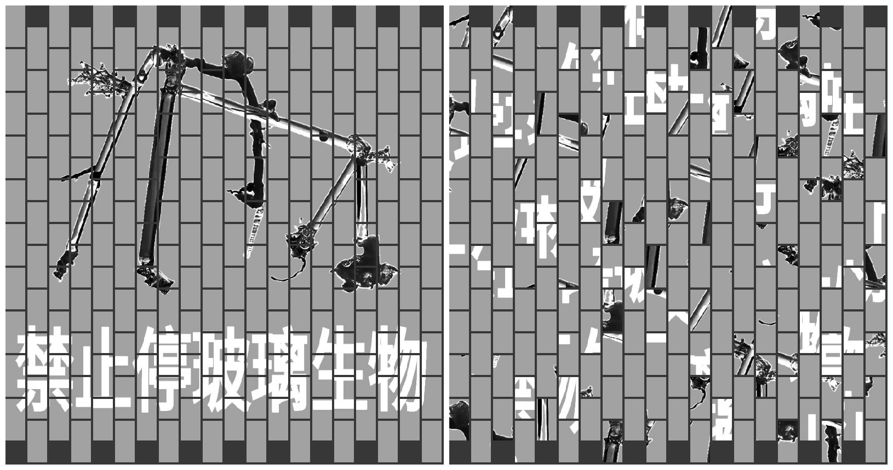
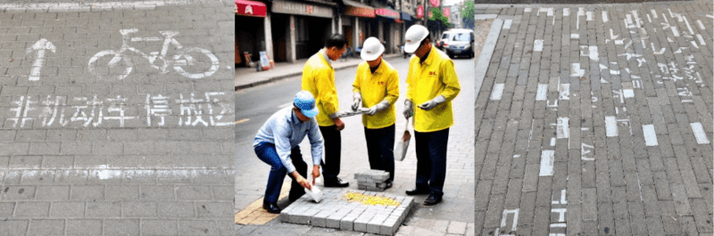
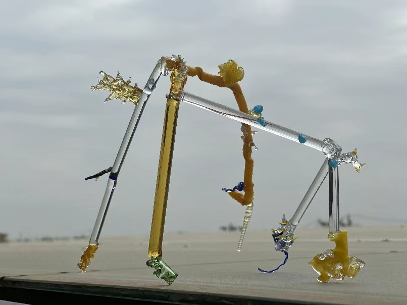
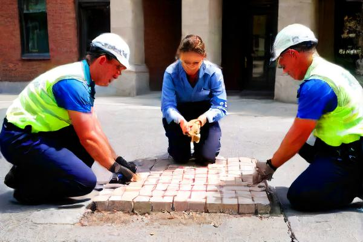

# artParking2

### Artist Proposal for Art Parking Exhibition: "Parallel Urban Palimpsest"

### 艺术家提案：《平行都市遗迹》

*Instance of **Parallel Urban Palimpsest (a)** 2024*

**艺术家团体：** 《日常生活手册》工作者:   [David Lane,](https://www.davidlaneartist.com/) [RedJade Yuan,](https://www.saatchiart.com/RedjadeYuan) [Gregory Kreisman](https://greggelong.github.io)

**展览标题：** 都市遗迹  
**媒介：** 混合媒介装置  
**空间需求：** 3.5 x 5 米停车位  

#### 概念框架：
《都市遗迹》，作为《日常生活手册》系列的一部分，探索了另一个现实中的公共工程，其中存在着有机和几何玻璃生物，它们在由模板标志控制的城市景观中穿行。这个装置深入研究了受日常城市维护影响而产生的新兴艺术形式，另一方面又管理着这些神秘生物的移动，这些生物如同神话般的都市居民的交通规则。

*Workers performing city maintenance*

#### 艺术品描述：
这个装置包括 200 多块砖和雕刻的玻璃生物，形成了有形和虚幻之间的动态互动。每一块砖都涂有耐用的户外漆，并带有有关人类和生物在这个替代都市生态系统中互动的图像和指示的模板。玻璃生物代表有机和几何形式，被轻盈地悬挂在砖块镶嵌物上方，为传统的水平街头艺术叙事引入了垂直维度。

*glass creature*

#### 互动元素：
鼓励观众与装置互动，通过重新排列砖块观察玻璃生物位置的变化。这种参与强调了都市环境中持续创造和适应的特性。通过二维码链接的数字组成部分，观众可以将虚拟玻璃生物融入到他们的个性化“砖瓦肖像”中，进一步融合有机和建筑主题。

#### 材料：
- 200 多块标准尺寸的砖
- 耐用的户外漆和模板
- 有机和几何形态的玻璃雕塑
- 用于悬挂玻璃生物的悬挂系统
- 艺术家表演者的工人服装
- 链接到交互式应用程序的二维码
- 用于砖块重新排列的工具（手套、护膝）

#### 艺术家参与：
三位艺术家穿着工人服装，以模糊日常城市工作者和创作者之间的界限，最初会按照预先定义的模式摆放砖块。在展览期间，他们将定期重新排列砖块，有时按照特定的算法，有时随机变换。这种表演性质展示了都市转变的流动性和随机性，进一步丰富了观众对装置的体验。

*Artists creating **Parallel Urban Palimpsest** (b) 2024*

#### 物流和设置：
- **准备：** 砖块将预先涂漆和固化；玻璃生物将被制作并准备好安全悬挂。
- **安装：** 设置包括砖块布置和悬挂玻璃生物，需要约 4 小时的艺术家团队。
- **维护：** 每天清扫和维护，确保安全和视觉吸引力。
- **拆卸：** 在展览结束时，有效地移除材料，可能会重新组装作为巡回展览。

#### 展览目标：
《都市遗迹》旨在引发人们对于都市空间和物体的审美和功能价值的重新思考，强调了自然和建造元素在都市环境中的共存。该项目促进了社区互动和创造性表达，弥合了艺术、科技和神话之间的鸿沟。

#### 结论：
通过《都市遗迹》，《日常生活手册》工作者们与“Art Parking”观众展开了关于都市转变和共创的对话。这个装置不仅反映了都市变化，而且通过民主化的艺术创作过程，使公众能够积极参与塑造艺术景观。

### Artist Proposal for Art Parking Exhibition: "Parallel Urban Palimpsest"

*Instance of **Parallel Urban Palimpsest (a)** 2024*

**Artist Group:** The Workers of the Manual for Everyday Life: [David Lane,](https://www.davidlaneartist.com/) [RedJade Yuan,](https://www.saatchiart.com/RedjadeYuan) [Gregory Kreisman](https://greggelong.github.io) 

**Exhibition Title:** Urban Palimpsest  
**Medium:** Mixed Media Installation  
**Space Requirements:** 3.5 x 5m parking space  

#### Conceptual Framework:
"Urban Palimpsest," part of "The Manual for Everyday Life" series, extends into a fantastical exploration of public works within an alternate reality. Here, organic and geometric glass creatures exist, navigating an urban landscape governed by stenciled pavement signs. This installation delves into emergent art forms influenced by routine city maintenance, with the added twist of managing these mystical beings' movements akin to traffic rules for mythical urban dwellers.

*Workers performing city maintenance*

#### Description of Artwork:
The installation features over 200 bricks and sculpted glass creatures, creating a dynamic interplay between the tangible and the ethereal. Each brick, painted with durable outdoor paint, bears stencils of images and directives for both human and creature interactions within this alternative urban ecosystem. The glass creatures, representing both organic and geometric forms, are delicately suspended above the brick mosaic, introducing a vertical dimension to the horizontal street art narrative.

*glass creature*

#### Interactive Element:
Visitors are encouraged to interact with the installation by rearranging the bricks and observing the corresponding adjustments in the glass creatures' positioning. This engagement highlights the continual creation and adaptation inherent in urban environments. An accompanying digital component, accessible via QR code, allows visitors to integrate virtual glass creatures into their personalized "brick tile portraits," further blending organic and architectural themes.

#### Materials:
- 200+ standard size bricks
- High-durability outdoor paint and stencils
- Glass sculptures of organic and geometric forms
- Suspension systems for the glass creatures
- Workmen’s uniforms for artist performers
- QR code linked to interactive app
- Tools for brick rearrangement (gloves, knee pads)

#### Artist Participation:
Three artists, dressed in workmen’s uniforms to blur the line between everyday city workers and creators, will initially arrange the bricks in a predefined pattern. Throughout the duration of the show, they will periodically rearrange the bricks, sometimes following a specific algorithm and at other times making random changes. This performance aspect demonstrates the fluidity and randomness of urban transformations, further enriching the viewer's experience of the installation.

*Artists creating **Parallel Urban Palimpsest** (b) 2024*

#### Logistics and Setup:
- **Preparation:** Bricks will be pre-painted and cured; glass creatures will be crafted and prepared for secure hanging.
- **Installation:** Setup involves arranging bricks and suspending glass creatures, requiring approximately 4 hours with a team of artists.
- **Maintenance:** Daily sweeping and maintenance ensure safety and visual appeal.
- **Deinstallation:** Efficient removal of materials at exhibition close, with potential reassembly for traveling exhibitions.

#### Exhibition Goals:
"Urban Palimpsest" aims to provoke reconsideration of the aesthetic and functional values assigned to urban spaces and objects, emphasizing the coexistence of natural and constructed elements within urban settings. The project fosters community interaction and creative expression, bridging art, technology, and mythology.

#### Conclusion:
With "Urban Palimpsest," The Workers of the Manual for Everyday Life engage the Art Parking audience in a dialogue about urban transformation and co-creation. This installation not only reflects on urban change but also democratizes the art creation process, allowing the public to participate actively in shaping the artistic landscape.

---

[Return](https://greggelong.github.io/urban)

[Create Brick Self-portrait](https://greggelong.github.io/parking)

[Transform your own images](https://greggelong.github.io/parkingDrop)
